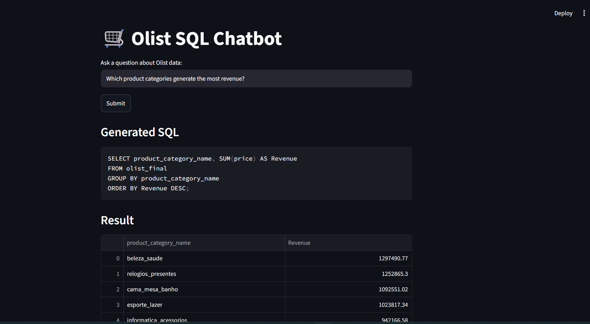

# 🛒 Olist SQL Chatbot

An AI-powered Text-to-SQL chatbot that converts plain English 
questions into SQL queries using Google Gemini API and executes 
them on the Olist Brazilian E-Commerce database.

## Demo

## How It Works
1. User types a business question in plain English
2. Gemini API generates a SQLite query automatically
3. Query executes on Olist SQLite database
4. Results displayed instantly on Streamlit

## Example Questions
- "Most preferred payment method"
- "Which state generates highest revenue?"
- "Top 5 product categories by sales"
- "Average delivery days by state"
- "How many orders were delivered late?"
- "Total revenue by city"

## Tools Used
- Python
- Google Gemini API (gemini-2.5-flash)
- SQLite
- Pandas
- Streamlit
- Prompt Engineering
- Text-to-SQL Generation

## Project Structure
olist-sql-chatbot/

├── app.py              → Streamlit frontend

├── generate_sql.py     → Gemini API + SQL logic

├── requirements.txt    → Dependencies

├── .gitignore          → Files to ignore

└── README.md           → Project documentation

## Setup & Run Locally
1. Clone the repository:
   git clone https://github.com/kashishhh28/olist-sql-chatbot

2. Install dependencies:
   pip install -r requirements.txt

3. Create .env file and add your Gemini API key:
   GEMINI_API_KEY=your_key_here

4. Add your olist.db database file

5. Run the app:
   streamlit run app.py

## Key Features
- Natural language to SQL conversion
- Real-time query execution
- Clean results display
- Business-focused prompt engineering
- Secure API key management with .env

## Note
The olist.db database file is not included due to size.
You can generate it from the Olist CSV files using pandas and sqlite3.
